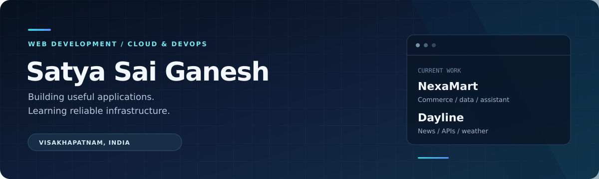

  

  <strong>Polavarapu Satya Sai Ganesh</strong> 
  Early-career developer · Visakhapatnam, India 
  Open to cloud, DevOps and developer internships and entry-level opportunities.

  <a href="https://github.com/psatyasaiganesh-oss?tab=repositories">Explore my repositories</a>
  &nbsp;·&nbsp;
  <a href="https://github.com/psatyasaiganesh-oss/portfolio-website">Portfolio source</a>

---

## About me

I build web applications that connect practical interfaces with APIs and persistent data. My recent projects include an ecommerce demo with a catalog-aware assistant and a news reader with live feeds and local weather.

Alongside web development, I’m learning cloud infrastructure and DevOps, with a focus on AWS, Terraform and reliable application delivery. I’m looking for opportunities to grow through hands-on engineering work.

## Featured projects

| Project | What it demonstrates | Technology |
| :--- | :--- | :--- |
| **[NexaMart](https://github.com/psatyasaiganesh-oss/Nexamart)** | Ecommerce demo with persistent carts, wishlists, inventory, orders and a shopping assistant. Optional OpenAI integration with catalog-help fallback. | React · TypeScript · Cloudflare Workers · D1 / SQLite · Drizzle |
| **[Dayline](https://github.com/psatyasaiganesh-oss/Dayline)** | News and weather dashboard with publisher RSS feeds, category browsing, city search, geolocation and a five-day forecast. | React · TypeScript · Tailwind CSS · API routes · Open-Meteo |
| **[Personal portfolio](https://github.com/psatyasaiganesh-oss/portfolio-website)** | Responsive presentation of my projects, background and technical interests. | HTML · CSS · JavaScript · Bootstrap |
| **[MediTech Innovation](https://github.com/psatyasaiganesh-oss/Meditech-Innovation)** | Healthcare interface prototype with JSON-based symptom matching, built as an educational web demo. | HTML · CSS · JavaScript · JSON |

<strong>Explore the implementation</strong>

- **NexaMart:** [store API](https://github.com/psatyasaiganesh-oss/Nexamart/blob/main/app/api/store/route.ts) · [database schema](https://github.com/psatyasaiganesh-oss/Nexamart/blob/main/db/schema.ts) · [assistant tests](https://github.com/psatyasaiganesh-oss/Nexamart/blob/main/tests/assistant.test.cjs)
- **Dayline:** [news API](https://github.com/psatyasaiganesh-oss/Dayline/blob/main/app/api/news/route.ts) · [weather API](https://github.com/psatyasaiganesh-oss/Dayline/blob/main/app/api/weather/route.ts) · [dashboard](https://github.com/psatyasaiganesh-oss/Dayline/blob/main/components/dayline.tsx)
- **Portfolio:** [single-page implementation](https://github.com/psatyasaiganesh-oss/portfolio-website/blob/main/index.html)
- **MediTech:** [interface and symptom-matching implementation](https://github.com/psatyasaiganesh-oss/Meditech-Innovation/blob/main/index.html)

## Technical toolkit

| Area | Technologies |
| :--- | :--- |
| Recent application work | TypeScript · JavaScript · React · HTML · CSS · Tailwind CSS |
| Backend and data | API routes · Cloudflare Workers · D1 / SQLite · Drizzle ORM |
| Development tools | Git · GitHub · pnpm |
| Additional foundations | Python · SQL · Bootstrap |

## Learning focus

- **Cloud and infrastructure:** AWS fundamentals and infrastructure as code with Terraform.
- **Delivery:** CI/CD concepts and repeatable deployment workflows.
- **Reliability:** Monitoring, troubleshooting and failure handling.

## Connect

I’m interested in cloud and DevOps internships, entry-level development roles, and opportunities to contribute to useful applications.

[GitHub](https://github.com/psatyasaiganesh-oss) · [Portfolio repository](https://github.com/psatyasaiganesh-oss/portfolio-website)
